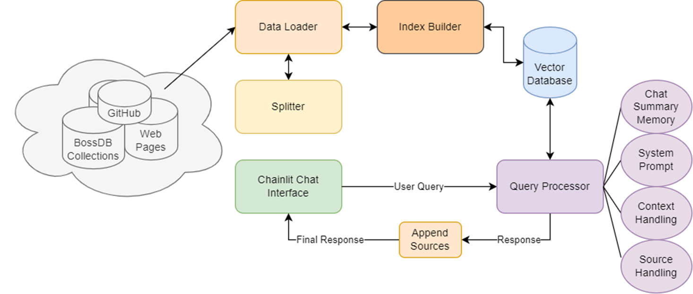

# BossDB RAG System: A Language Interface to the BossDB Ecosystem

A Retrieval-Augmented Generation (RAG) system specifically designed for BossDB documentation and data queries. This system combines the power of large language models with contextual document retrieval (embedding models) to provide accurate, source-backed answers about BossDB, its tools, and related neuroscience data.

## 🌟 Features

- **Intelligent Query Processing**: Combines vector search with LLM-based response generation
- **Conversation Memory**: Maintains context across multiple queries with one of two memory modes:
  - Summary-based memory using Claude 3 Haiku for efficient compression
  - Window-based memory for maintaining recent conversation history
- **Source Attribution**: Every response includes references to the source documents used
- **Multi-Source Knowledge Base**: Automatically ingests and indexes content from:
  - Documentation websites
  - GitHub repositories
  - API specifications
  - Academic papers
  - Jupyter notebooks
- **Token Management**: Intelligent handling of token limits for both queries and conversation history
- **Conversation Tracking**: Database-backed system for tracking user interactions and chat sessions

## 🔧 Installation

1. Clone the repository:

```bash
git clone https://github.com/aplbrain/bossdb-rag.git
cd bossdb-rag
```

2. Create and activate a virtual environment:

   - Requires Python 3.10 and above

```bash
python3 -m venv venv
source venv/bin/activate  # On Windows: venv\Scripts\activate
```

3. Install dependencies:

   - May need to do the following on Ubuntu: `sudo apt-get install build-essential python3-dev`, `pip install wheel`, and `sudo apt-get install libsqlite3-dev`

```bash
pip install -r requirements.txt
```

4. Set up environment variables:

```bash
export AWS_ACCESS_KEY_ID="your_aws_access_key"
export AWS_SECRET_ACCESS_KEY="your_aws_secret_key"
export AWS_REGION="your_aws_region"
export GITHUB_TOKEN="your_github_token"
```

## ⚙️ Configuration

All system configuration is managed through `config.yaml` in the project root. The configuration is organized into three main sections:

### LLM Configuration (`llm_config`)

```yaml
llm_config:
  default_llm: "anthropic.claude-3-5-sonnet-20240620-v1:0"  # Main response generation model
  fast_llm: "anthropic.claude-3-haiku-20240307-v1:0"        # Memory summarization model
  embed_model: "cohere.embed-english-v3"                     # Text embedding model
  
  # AWS Bedrock credentials (loaded from environment variables)
  aws_region: "OS_ENV_AWS_REGION"
  aws_access_key_id: "OS_ENV_AWS_ACCESS_KEY_ID"
  aws_secret_access_key: "OS_ENV_AWS_SECRET_ACCESS_KEY"
  
  # GitHub authentication
  github_token: "OS_ENV_GITHUB_TOKEN"
```

### Usage Limits (`limits`)

```yaml
limits:
  max_questions: 1000          # Maximum questions per session
  max_words: 100000           # Maximum total words per session
  max_message_tokens: 4096    # Maximum tokens per message
  max_total_tokens: 8192      # Maximum conversation history tokens
```

### Data Sources (`sources`)

```yaml
sources:
  urls:                      # List of documentation sources
    - "https://docs.url"
    - "https://api.url"
  github_orgs:              # GitHub organizations to index
    - "org1"
    - "org2"
```

### Environment Variables

Values prefixed with `OS_ENV_` in the config file are loaded from environment variables. Required variables:

- `AWS_REGION`
- `AWS_ACCESS_KEY_ID`
- `AWS_SECRET_ACCESS_KEY`
- `GITHUB_TOKEN`

### Updating Configuration

1. Modify `config.yaml` as needed
2. Ensure required environment variables are set
3. Restart the application to apply changes

### Storage

The system maintains its vector store and user history in:

- SQLite database (`bossdb_rag.db`)
- Vector store files (`./storage/`)

These are automatically created on first run.

## 🚀 Usage

### Starting the Application

Run the application using Chainlit:

```bash
chainlit run main.py
```

This will start the web interface on `http://localhost:8000`.

## 💾 Data Storage

The system uses SQLite for storing:

- User information
- Chat threads
- Message history
- Usage statistics

Database schema is defined in `database_models.py`.

## 🔄 RAG Pipeline

1. **Document Processing**
   - Documents are loaded from configured sources
   - Content is split into chunks using appropriate splitters
   - Chunks are embedded and stored in a vector index

2. **Query Processing**
   - User query is processed
   - Relevant documents are retrieved using vector similarity
   - Context is combined with conversation history
   - Response is generated using Claude 3.5 Sonnet
   - Sources are processed and attached to response

3. **Memory Management**
   - Conversation history is maintained using either:
     - Summary-based memory (using Claude 3 Haiku)
     - Window-based memory (keeping recent messages)
   - Token limits are enforced for both individual messages and total context

## 🛠️ Development

### Pipeline Structure



### Adding New Data Sources

Adding new data sources is simple through the `config.yaml` file. No code changes are required - just update the configuration.

1. Open `config.yaml` in the project root directory
2. Navigate to the `sources` section:

```yaml
sources:
  # Add new URLs to the urls list
  urls:
    - "https://existing-url.com"
    - "https://your-new-documentation-url.com"     # Add new URLs here
    - "https://github.com/org/repo"                # GitHub repositories are supported
    - "https://api-endpoint.com/openapi.json"      # API specifications
    
  # Add new GitHub organizations to github_orgs list
  github_orgs:
    - "existing-org"
    - "your-new-org"                              # Add new organizations here
```

The system supports various types of sources:

- Documentation websites
- GitHub repositories (including wikis, specific files, or entire repos)
- API specifications (OpenAPI/Swagger)
- Academic papers
- Jupyter notebooks
- Markdown files
- JSON endpoints

When adding new sources, ensure they:

- Are publicly accessible (or accessible with provided GitHub token)
- Contain relevant BossDB-related content
- Have stable URLs that won't frequently change

After updating the configuration:

1. Shutdown the application (if running)
2. Delete the old `storage` folder
3. Start up the application
4. The system will automatically process and index the new sources
5. New content will be immediately available for queries

### Customizing Document Processing

Modify `Splitter` class to add new document types:

```python
def split(self, document: Document) -> List[Document]:
    file_extension = self._get_file_extension(document)
    if file_extension == ".new_type":
        return self.custom_splitter.get_nodes_from_documents([document])
```

## 📊 Monitoring

The system includes comprehensive logging:

- Application logs in console and `bossdb_rag.log`
- Database viewer script `view_database.py`

## ⚠️ Limitations

- Requires valid AWS credentials for Bedrock access
- GitHub token required for repository access
- Protections against single user spamming
- Multiple users are supported through Chainlit but is limited
- Requires some level of local compute for calculating distances for vector search

## 📄 License

[Apache-2.0 license](LICENSE.txt)

---

<p align=center><b>Made with 💙 at <a href="https://jhuapl.edu"></a></b></p>
